 

## 💫 About Me

- 🔭 I'm currently working on **fine-tuning reward systems for my personal AI assistant, Arjun**
- 👯 I'm looking to collaborate on **open-source Generative AI projects and Android apps**
- 🤝 I'm looking for help with **integrating 3D animated characters into UI/UX**
- 🌱 I'm currently learning **Generative AI, Flask/Django, and Android Development**
- 💬 Ask me about **Python, SQL, and fine-tuning LLMs**
- ⚡ Fun fact: **I spend as much time fixing my dev environment as I do coding in it**

 

## 🌐 Socials

 

## 📊 GitHub Stats

 

## 🛠️ Tech Arsenal

**💻 Languages**

**⚛️ Frameworks & Development**

**🗄️ Database & Cloud**

**🤖 AI & Data**

 

## 👾 Contribution Invaders

  

 

## ✍️ Random Dev Quote

